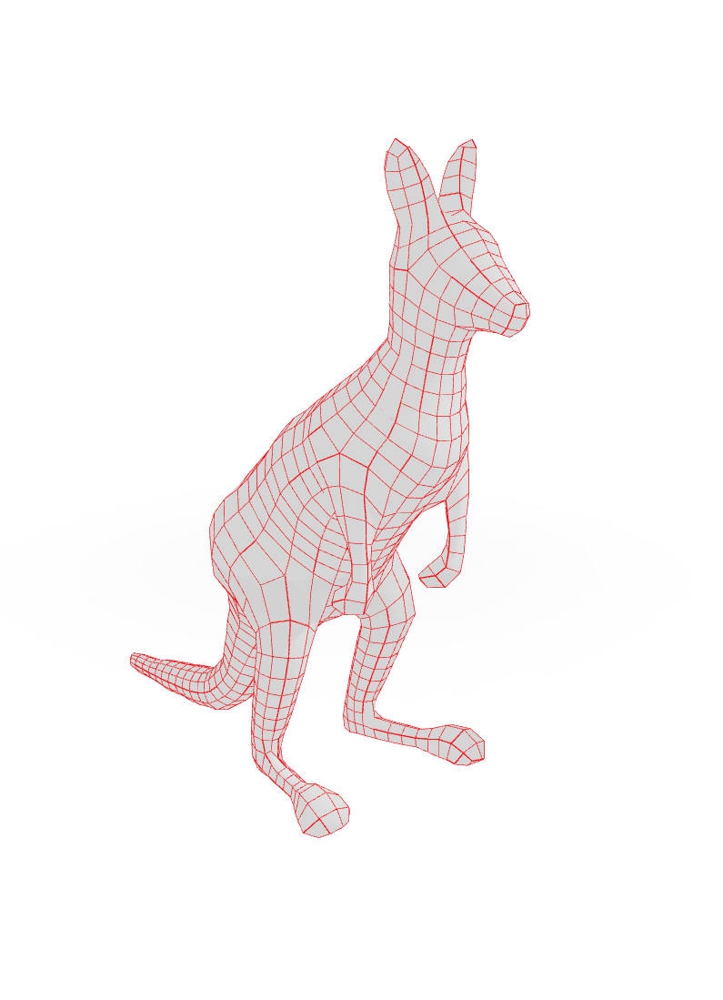
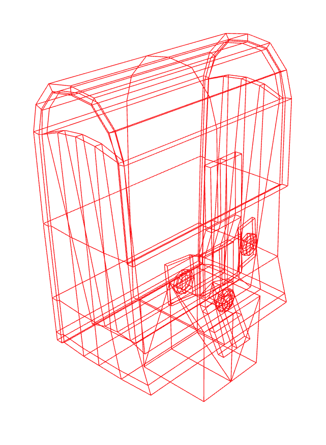

# QuadFrame Geometry for Three JS !!!

Three JS only comes with a default triangle mesh option. The QuadFrameGeometry class found in Quad.js allows for the creation of a responsive quafFrameGeometry wireframe for your viewing and modelling needs!

Simple use the QuadFrameGeometry class exactly like WireFrameGeometry, and add the wireframe to you scene. 

Look at some results:

Enjoy!

